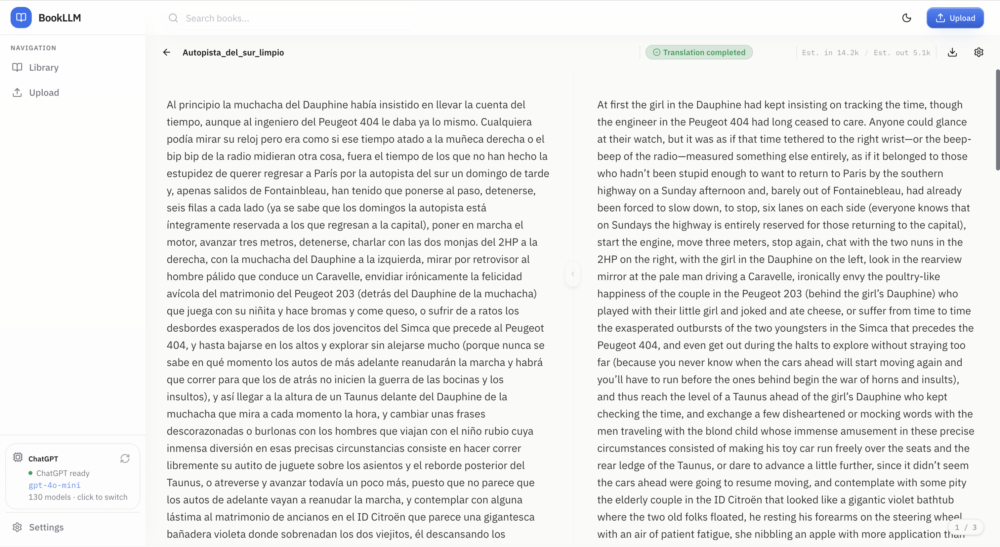
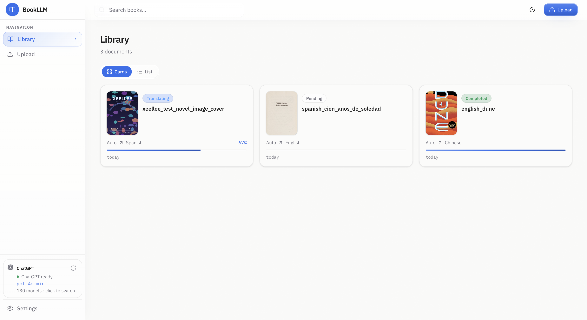
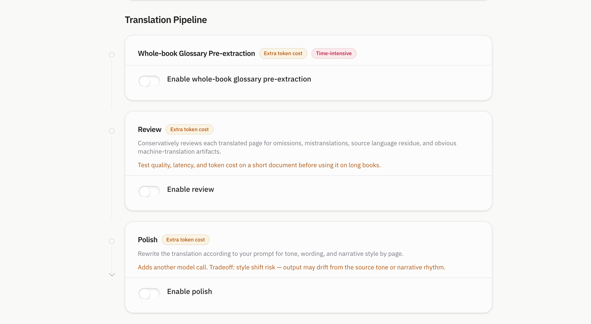

# BookLLM

<p align="center">
  <a href="README.md">
    
  </a>
  <a href="README_ZH.md">
    
  </a>
  <a href="#license">
    
  </a>
</p>

BookLLM is a self-hosted book translation app with glossary, review, and polish pipelines.

It supports OpenAI-compatible APIs and local LLM runtimes for long-form reading and iterative translation workflows.

Current language options support translation between Chinese, English, Japanese, Korean, French, German, Spanish, and Russian. Source language can also be set to auto-detect.

<p align="center">
  
</p>

<p align="center">
  <sub>Bilingual long-form reading with live translation output.</sub>
</p>

## Features

<table>
  <tr>
    <td width="33%" valign="top">
      <strong>OpenAI-compatible</strong><br />
      Works with OpenAI-compatible providers and runtimes, including OpenAI, DeepSeek, OpenRouter, Ollama, LM Studio, and OMLX.
    </td>
    <td width="33%" valign="top">
      <strong>Live Reader</strong><br />
      Stream translations directly into a bilingual long-form reading interface.
    </td>
    <td width="33%" valign="top">
      <strong>Multi-stage Pipeline</strong><br />
      Translate with optional glossary extraction, review, and polishing stages.
    </td>
  </tr>
  <tr>
    <td width="33%" valign="top">
      <strong>Sidekick Model</strong><br />
      Use Sidekick as an optional second model for review, polishing, or quality-focused stages.
    </td>
    <td width="33%" valign="top">
      <strong>Glossary Support</strong><br />
      Maintain per-page glossary context, with optional whole-book extraction.
    </td>
    <td width="33%" valign="top">
      <strong>PDF / OCR Support</strong><br />
      Extract text from PDFs and use bundled OCR for scanned pages.
    </td>
  </tr>
</table>

## Screenshots

<table>
  <tr>
    <td width="50%" valign="top" align="center">
      
      <br />
      <strong>Library</strong>
      <br />
      <sub>Books, progress, and translation tasks.</sub>
    </td>
    <td width="50%" valign="top" align="center">
      
      <br />
      <strong>Translation Pipeline</strong>
      <br />
      <sub>Glossary, review, and polishing configuration.</sub>
    </td>
  </tr>
</table>

## Pipeline Cost Notice

> [!IMPORTANT]
>
> Enabling optional pipeline stages can significantly increase token usage, API cost, and processing time.
>
> These stages may improve translation quality, but the marginal gain is not always large enough to justify the extra cost and latency, especially for everyday translation tasks.
>
> Before using the full pipeline on a long document, test it on a short file or a small excerpt first. Compare output quality, latency, and token usage, then enable only the stages that clearly help your use case.

## Quick Start

Run BookLLM locally with Docker Compose. No `.env` file is required for single-machine use.

```bash
git clone https://github.com/purecodework/bookllm.git
cd BookLLM
docker compose up -d --build
```

Then open:

```text
http://localhost:3000
```

For later starts, use:

```bash
docker compose up -d
```

Rebuild only after source, dependency, or Dockerfile changes:

```bash
docker compose up -d --build
```

### Initial Setup

1. Open **Model Connection** from the sidebar.
2. Configure your OpenAI-compatible endpoint:
   - Base URL: an OpenAI-compatible <code>/v1</code> endpoint, such as <code>https://api.openai.com/v1</code>
   - For a host-local runtime such as Ollama, <code>http://localhost:11434/v1</code> is accepted; Docker deployments normalize it internally when needed
   - API key
   - Model
3. Optional: if you are using a hosted API provider instead of a local runtime, tune the input token budget and concurrency in **Settings** to improve throughput.
4. Upload an EPUB, PDF, or TXT file to begin translation.

## Architecture

```text
Next.js frontend
  -> NestJS API + SSE
     -> PostgreSQL: books, pages, settings, glossary/context, token usage
     -> Redis: BullMQ queues, job state, event fanout
     -> Translation workers: chunking, glossary/context, translation, review, polish, export
     -> FastAPI OCR service: PyMuPDF + Tesseract
     -> Local asset storage: originals, covers, extracted images
     -> OpenAI-compatible LLM endpoints: primary + optional Sidekick
```

## Known Limitations

- Token usage shown in the UI is approximate. Provider dashboards remain the billing source of truth.
- OCR does not preserve the original layout.

## License

MIT
