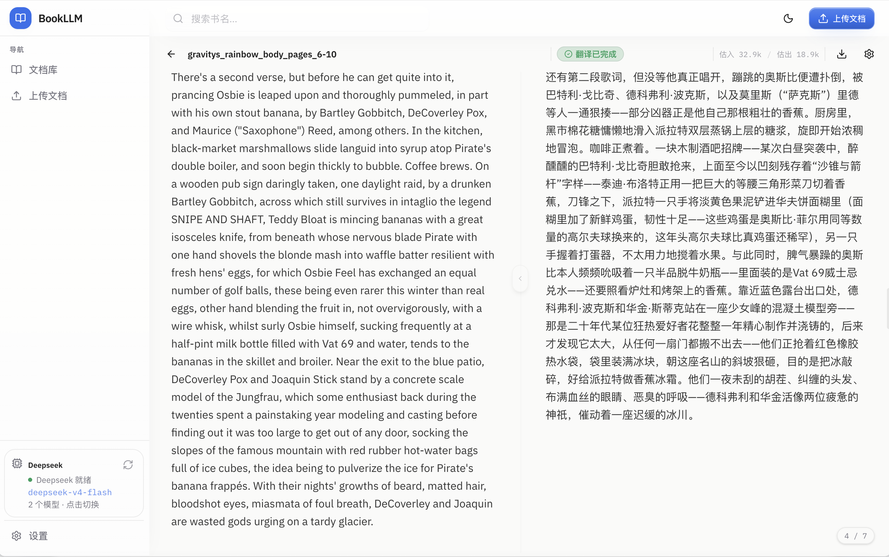
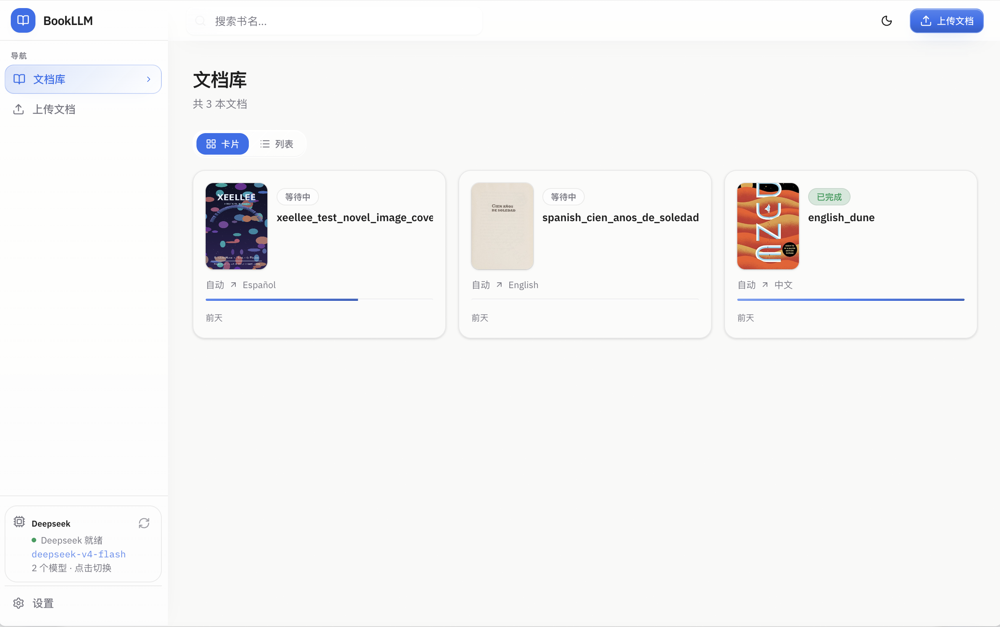
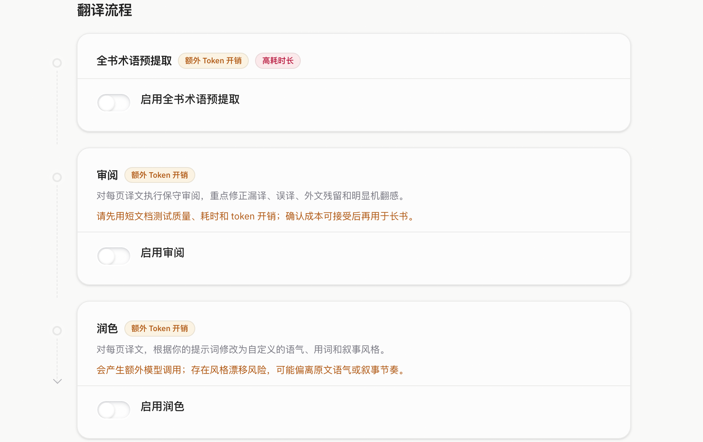

# BookLLM

<p align="center">
  <a href="README.md">
    
  </a>
  <a href="README_CN.md">
    
  </a>
  <a href="#license">
    
  </a>
</p>

BookLLM 是一个面向长文本阅读和迭代式翻译流程的文档与图书翻译应用。

支持 OpenAI兼容的 API 和本地LLM平台，并提供多阶段翻译流水线，包括术语表提取、翻译、校对和润色。

当前语言选项支持中文、英文、日文、韩文、法文、德文、西班牙文、俄文之间互译；原文语言也可以选择自动识别。

<p align="center">
  
</p>

<p align="center">
  <sub>支持双语长文本阅读，并可实时显示翻译输出。</sub>
</p>

## 功能特性

<table>
  <tr>
    <td width="33%" valign="top">
      <strong>OpenAI-compatible 支持</strong><br />
      支持 OpenAI兼容的 服务商与本地运行环境，例如 OpenAI、DeepSeek、OpenRouter、OMLX 等。
    </td>
    <td width="33%" valign="top">
      <strong>实时阅读器</strong><br />
      翻译生成过程中，内容可以直接流式写入双语长文本阅读界面。
    </td>
    <td width="33%" valign="top">
      <strong>多阶段翻译流水线</strong><br />
      支持翻译流程中可选启用术语表提取、校对和润色阶段。
    </td>
  </tr>
  <tr>
    <td width="33%" valign="top">
      <strong>第二模型</strong><br />
      可选为第二模型，用于校对、润色或其他质量增强阶段。
    </td>
    <td width="33%" valign="top">
      <strong>术语表支持</strong><br />
      默认维护分页级累计术语上下文，也可选择进行整本书术语表提取。
    </td>
    <td width="33%" valign="top">
      <strong>PDF / OCR 支持</strong><br />
      支持从 PDF 中提取文本，并可通过内置 OCR 处理扫描页。
    </td>
  </tr>
</table>

## 截图

<table>
  <tr>
    <td width="50%" valign="top" align="center">
      
      <br />
      <strong>书库</strong>
      <br />
      <sub>管理书籍、翻译进度与翻译任务。</sub>
    </td>
    <td width="50%" valign="top" align="center">
      
      <br />
      <strong>翻译流水线</strong>
      <br />
      <sub>配置术语表、校对和润色阶段。</sub>
    </td>
  </tr>
</table>

## Pipeline 成本提醒

> [!IMPORTANT]
>
> 启用可选的 Pipeline 选项会显著增加 token 消耗、API 成本和处理时间。
>
> 这些阶段可能提升翻译质量，但边际收益不一定足以抵消额外成本和延迟，通常不建议开启。
>
> 在对长文档启用完整 Pipeline 之前，建议先使用短文本或小段摘录进行测试。请比较输出质量、处理时间和 token 使用量。

## 快速开始

使用 Docker Compose 在本地运行 BookLLM。

```bash
git clone https://github.com/purecodework/bookllm.git
cd BookLLM
docker compose up -d --build
```

然后打开：

```text
http://localhost:3000
```

### 初始设置

1. 从侧边栏打开 **Model Connection**。
2. 配置你的 OpenAI-compatible endpoint：
   - 基础 URL：需要兼容OpenAI API协议，期待 <code>/v1</code> 端点，比如：https://api.deepseek.com/v1
   - API 密钥
   - 模型
3. 可选：如果你使用的是托管 API 服务商，而不是本地模型运行环境，可以在 **Settings** 中调整输入 token 上限和并发数，以提升吞吐速度。
4. 上传 EPUB、PDF 或 TXT 文件，开始翻译。

## 架构

```text
Next.js frontend
  -> NestJS API + SSE
     -> PostgreSQL: books, pages, settings, glossary/context, token usage
     -> Redis: BullMQ queues, job state, event fanout
     -> Translation workers: chunking, glossary/context, translation, review, polish, export
     -> FastAPI OCR service: PyMuPDF + Tesseract
     -> Local asset storage: originals, covers, extracted images
     -> OpenAI-compatible LLM endpoints: primary + optional Sidekick
```

## 已知限制

- UI 中显示的 token 使用量为近似值，实际计费请以服务商后台为准。
- OCR 不会保留原始版面布局。

## License

MIT
